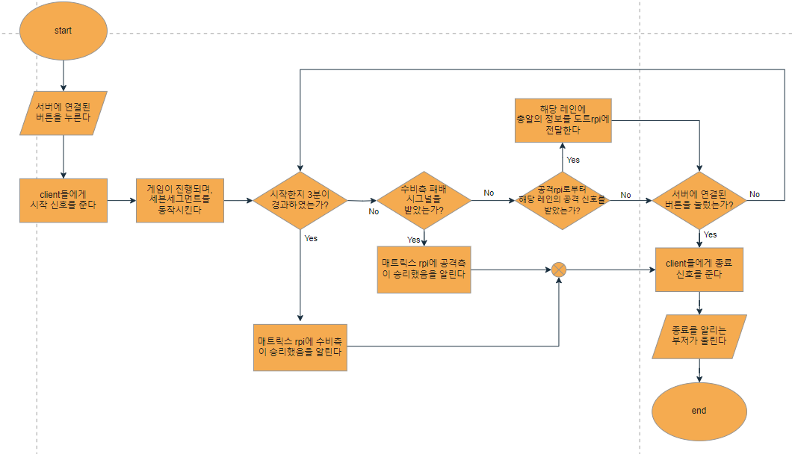

# 23-2 System Programming Team 1
2023년 가을학기, 아주대학교 시스템프로그래밍 1분반 팀프로젝트 1팀 코드입니다. 4개의 라즈베리파이를 활용하여 슈팅게임을 구현하였습니다.

## 👨‍🏫 프로젝트 소개
본 프로젝트는 두 명의 플레이어가 각각 각종 센서를 통해 공격, 수비를 진행하여 대결하는 슈팅 게임을 만드는 것을 목표로 한다. 

## ⏲️ 프로젝트 필요성 및 차별성
  - 식당이나 문구점에서 사용하는 기존 오락기는 버튼과 조이스틱으로만 플레이가 가능하였다. 이번 프로젝트에서는 다양한 sensor/actuator들을 사용하는 RPI 기반 시스템 구조를 갖춘 게임을 설계하였다.
  - 날아오는 총알을 조이스틱으로 피하는 기존 오락기와 달리 직접 공격, 즉 총알을 발사하여 일방적 수비가 아닌 1대1의 플레이가 가능한 의미를 가지고 있다.
  - 공격을 할 때 버튼을 사용하지 않고 다양한 센서를 통하여 공격의 여부를 결정하며 Sensor의 아날로그 값에 따라 공격의 강도를 조절할 수 있다.

## 🧑‍🤝‍🧑 개발자 소개 및 역할
- **김관주** : 소프트웨어학과(20), 공격 RPI 구현
- **송선우** : 소프트웨어학과(18), 도트매트릭스 RPI 구현
- **이주홍** : 수학과(20), 수비 RPI 구현
- **한이지** : 수학과(20), 서버 RPI 구현
 

## ✒️ Sensor 및 Actuator
- **공격 RPI** : 압력센서, 고감도 사운드 감지 센서, 가속도 센서, 초음파 센서, RGB LED 4개
- **수비 RPI** : 조이스틱, LED 3개, 서보모터
- **서버 RPI** : 7-세그먼트(3자리) , 스피커(부저)
- **도트매트릭스 RPI** : 8x8 도트매트릭스 3개

## 📝 프로젝트 아키텍쳐

## 📌 예상 시스템 동작 과정

### 서버 RPI

### 공격 RPI

### 수비 RPI

### 도트매트릭스 RPI

## 📷 데모

